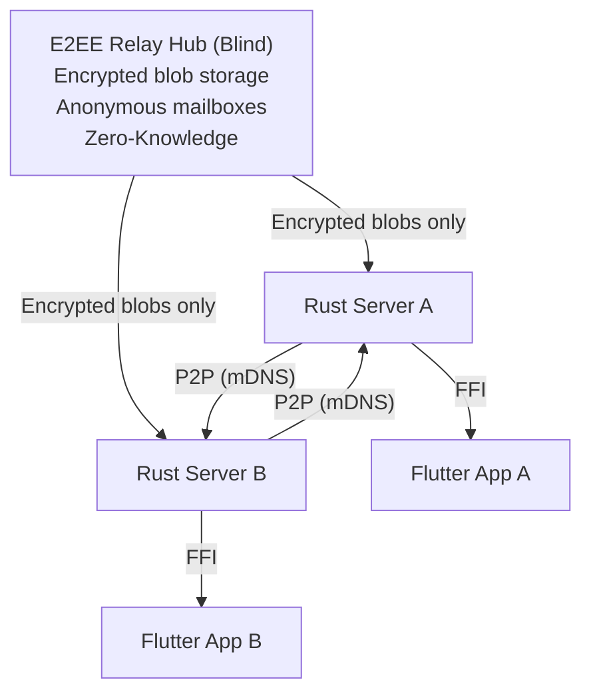

# BiblioGenius Ecosystem

> **Canonical repository: [Codeberg](https://codeberg.org/bibliogenius/bibliogenius-env).** The GitHub copy is a read-only mirror, automatically synced from Codeberg. Please open issues and pull requests on Codeberg.

A decentralized, local-first library management system: catalog your books, lend them to friends, and keep every device in sync, without surrendering your data to anyone.

🌐 **Website:** [bibliogenius.org](https://bibliogenius.org)

## 📱 Where to get it

BiblioGenius ships and is tested daily on **iOS, Android, and macOS**, the platforms we recommend today.
Desktop builds for **Windows and Linux** are available and still stabilizing.

> This repository is the **development environment** for the whole ecosystem. If you just want to use the app, head to [bibliogenius.org](https://bibliogenius.org). If you want to build or contribute, read on.

## ✨ Features

- **📚 Catalog Management**: Add books via ISBN scan (BNF, Inventaire, OpenLibrary, Google Books), manage copies, and track loans.
- **🤝 P2P Sharing**: Connect with friends' libraries, locally over your Wi-Fi network (zero-config mDNS discovery) or across the web, to browse and borrow.
- **🔐 End-to-End Encryption**: Stay in sync and reachable from anywhere through an encrypted relay. The hub only ever sees ciphertext.
- **🏆 Gamification**: Earn reputation ("Lender", "Archivist") and level up your librarian status.
- **🛡️ Backup & Export**: Full JSON export of your library for safekeeping.
- **🔒 Digital Sovereignty**: Local-first architecture. You own your data. No central server required.
- **🤖 MCP Integration**: "Speak with your library" using local AI agents via the Model Context Protocol.

## 📦 Components

Each component lives in its own repository. This **environment repo** orchestrates them: run `make setup P=<profile>` to clone and configure exactly what you need.

### [`bibliogenius/`](./bibliogenius) - Rust Server

The core backend. Runs **embedded** inside the app (via FFI) for offline-first performance, or **standalone** as an HTTP server for headless and self-hosted setups. Owns the SQLite database, P2P sync, and external metadata lookups.
🔗 <https://codeberg.org/bibliogenius/bibliogenius>

### [`bibliogenius-app/`](./bibliogenius-app) - Flutter App

The user-facing app for iOS, Android, and macOS (with Windows and Linux desktop builds). Embeds the Rust server and adds the scanner, catalog UI, multi-device sync, and peer lending.
🔗 <https://codeberg.org/bibliogenius/bibliogenius-app>

### [`bibliogenius-hub/`](./bibliogenius-hub) - Symfony Hub

An **optional** service you only need when devices are off the same network. It provides a public directory and a zero-knowledge relay: blind, store-and-forward encrypted mailboxes. It never sees your library data.
🔗 <https://codeberg.org/bibliogenius/bibliogenius-hub>

## 🚀 Quick Start (developers)

```bash
# Clone the environment repo
git clone https://codeberg.org/bibliogenius/bibliogenius-env.git
cd bibliogenius-env

# Set up for your profile (no-code / junior / senior)
make setup P=junior

# To switch profile later, just re-run with the new one:
make setup P=senior
```

The setup script clones the right repos, configures your AI tools (Claude Code / Cursor), and guides you through the next steps. Re-running with a different profile upgrades your environment (clones missing repos, adjusts hooks).

Alternative entry point: `python3 setup.py junior`. Non-technical contributors should start with [NO_CODE_ONBOARDING.md](./docs/NO_CODE_ONBOARDING.md).

## 🏗️ Architecture



## 📚 Documentation

- [NO_CODE_ONBOARDING.md](./docs/NO_CODE_ONBOARDING.md) - Guide for non-technical contributors
- [CLAUDE.md](./CLAUDE.md) - Architecture rules and AI assistant guidelines

## 🤝 Contributing

Contribute to the repository that matches your change (issues and PRs on **Codeberg**):

- Rust server → [`bibliogenius`](https://codeberg.org/bibliogenius/bibliogenius)
- Flutter app → [`bibliogenius-app`](https://codeberg.org/bibliogenius/bibliogenius-app)
- Symfony hub → [`bibliogenius-hub`](https://codeberg.org/bibliogenius/bibliogenius-hub)
- Environment / onboarding → [`bibliogenius-env`](https://codeberg.org/bibliogenius/bibliogenius-env) (this repo)

## 📄 License

AGPL-3.0-or-later - see the LICENSE file in each repository.

## 👤 Author

**Federico CALO**

- Website: <https://federico-calo.net>
- Codeberg: [@federico-calo](https://codeberg.org/federico-calo)
- Organization: [@bibliogenius](https://codeberg.org/bibliogenius)

---

**Status**: v1.1.7-beta.1 (Beta Testing)
